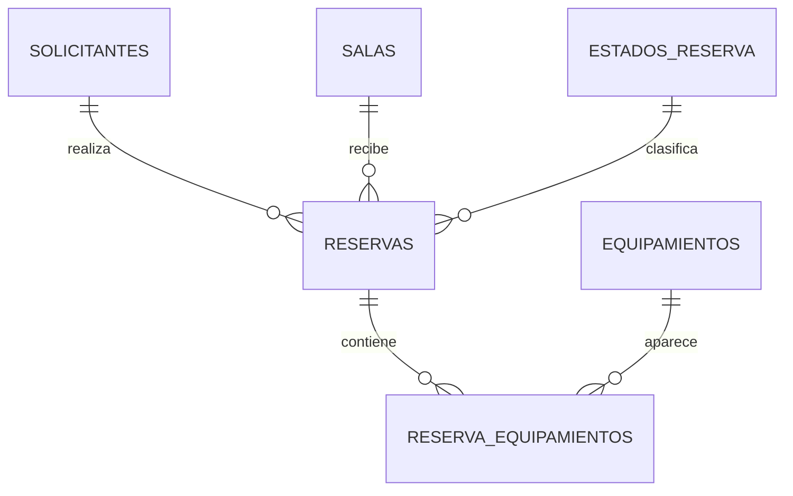

# Modelo relacional — centro_comunitario

| Tabla | Propósito | Relaciones |
|---|---|---|
| solicitantes | Identifica personas | 1 solicitante -> N reservas |
| salas | Espacios y capacidad | 1 sala -> N reservas |
| estados_reserva | Activa, Cancelada | 1 estado -> N reservas |
| equipamientos | Stock físico | 1 equipo -> N reserva_equipamientos |
| reservas | Horario, usuario, sala, estado, motivo | N:1 hacia solicitantes, salas, estados |
| reserva_equipamientos | Unidades solicitadas | N:M reservas/equipamientos |

## Diagrama ER (Mermaid)

Los datos se almacenan con `TIMESTAMP WITHOUT TIME ZONE` como **horarios locales** didácticos. En un producto mundial o con múltiples husos horarios se debe adoptar una estrategia formal de UTC/TIMESTAMPTZ. Los controles WinForms fijan `DateTimeKind.Unspecified` para corresponder con el tipo elegido.

El repositorio utiliza `FOR UPDATE` en sala y equipo para serializar reservas sobre el mismo recurso mientras comprueba solapes y cantidades. Como simplificación, un formulario permite como máximo **un tipo de equipamiento por reserva**, aunque la tabla puente permitiría varios. No se implementa edición de reservas ni alta de catálogos.